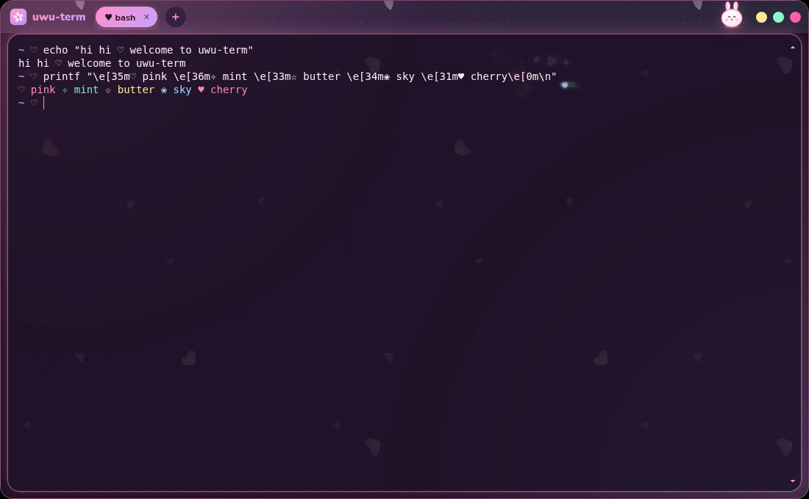
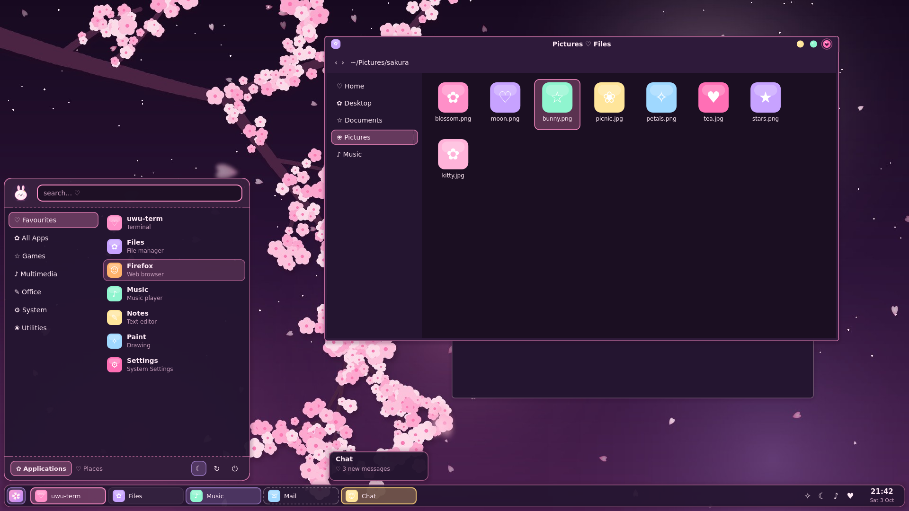
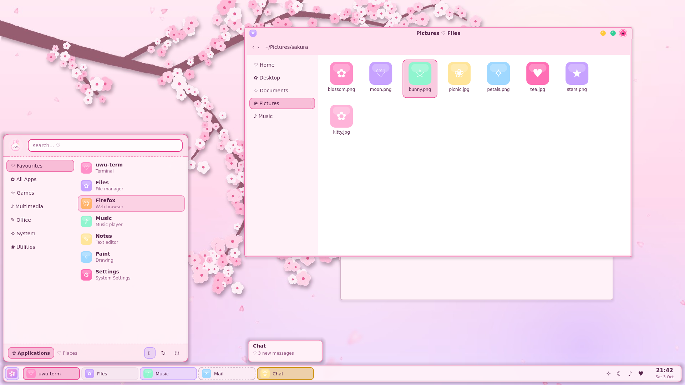
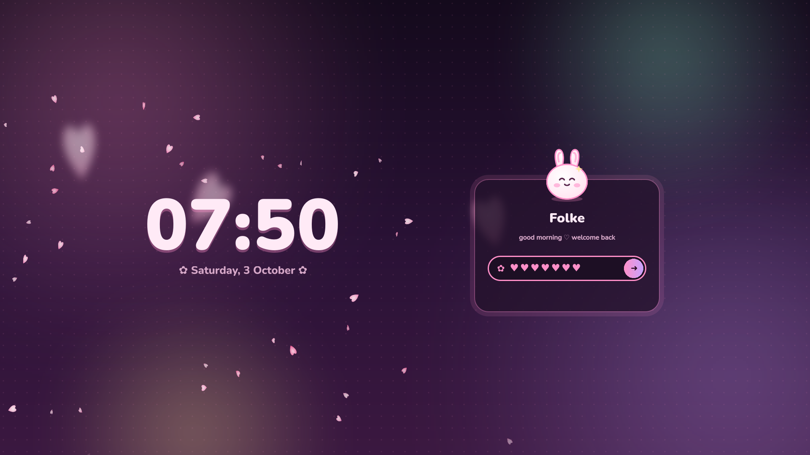
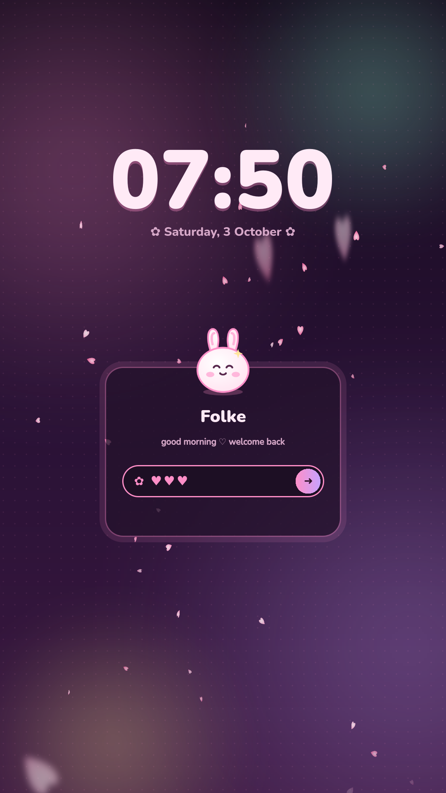

# ♡ uwu ✧

Super duper kawaii themes in one pastel palette (🌙 strawberry-milk night and 🌸 sakura cream
day), with falling sakura wherever we can get away with it.


**▶ [Watch the showcase](showcase/uwu-showcase.mp4)**: everything below working together, from boot splash to lock
screen (1080p60).

## What's inside

| | | |
| --- | --- | --- |
| **opencode** | [**web**](opencode/web/) | Firefox `userContent.css` for the opencode v2 web UI: falling sakura, gradient bubbles, a rainbow composer, bouncy everything |
| | [**tui**](opencode/tui/) | Terminal theme for the opencode v2 TUI (`uwu` and `uwu-transparent`) |
| **VS Code** | [**uwu IDE**](vscode/) | VS Code extension that turns VS Code into a kawaii IDE: themes, file icons, sakura petals, a full window makeover with splash screen, mascot, sparkles and confetti |
| **KDE Plasma** | [**desktop theme**](kde/plasma/) | The whole desktop: candy task bar, start menu, popups, pastel window title bars, night & day colours, a sakura wallpaper (portrait sizes too) and a bunny splash screen |
| | [**lock screen**](kde/lockscreen/) | A kawaii lock screen for Plasma 6: sakura, a bunny that sleeps, pouts and cheers, heart-shaped password dots, and a layout for monitors turned 90° |
| **Terminal** | [**uwu-term**](terminal/uwu-term/) | A kawaii terminal emulator for Arch + KDE Plasma (Wayland): sakura petals, candy tabs, a bunny mascot that reacts to your commands, confetti |

## Repo layout

```
opencode/
  web/          Firefox userContent.css for the opencode web UI
  tui/          opencode TUI themes
vscode/
  uwu-code/     the VS Code extension (source)
  uwu-code-0.2.1.vsix   ready-to-install package
kde/
  plasma/       the Plasma desktop theme (./install.sh)
  lockscreen/   the Plasma lock screen (./install.sh)
terminal/
  uwu-term/     the kawaii terminal emulator (Electron + xterm.js)
    packaging/arch/  PKGBUILD for makepkg -si
showcase/       the all-in-one video and the scripts that make it
tools/          generators shared by everything above
  palette.py      the shared colour palette
  petals.py       falling-sakura SVG tiles (web + VS Code)
  tui_theme.py    builds the opencode TUI themes
  vscode_theme.py builds the VS Code colour themes
  kawaii_assets.py draws the uwu IDE + uwu-term icons, mascot and file icons
  lockscreen_assets.py draws the lock screen's bunny moods and petals
  plasma_theme.py builds the Plasma style, colour schemes and title bars
  plasma_extras.py draws the sakura wallpaper, splash screen and global themes
```

Each section has its own README with install steps and screenshots.

| opencode web | opencode TUI |
| --- | --- |
|  |  |

| VS Code | Terminal |
| --- | --- |
|  |  |

| KDE Plasma | KDE Plasma (day) |
| --- | --- |
|  |  |

| Lock screen | Lock screen on a rotated monitor |
| --- | --- |
|  |  |
