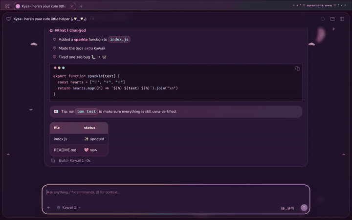
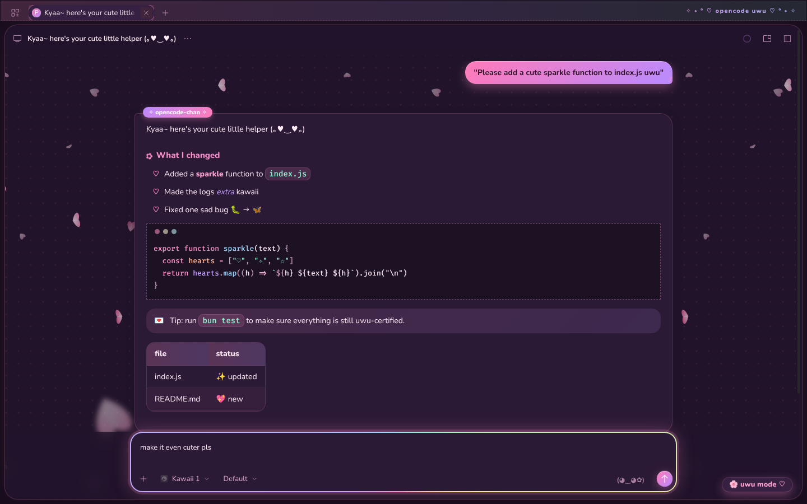
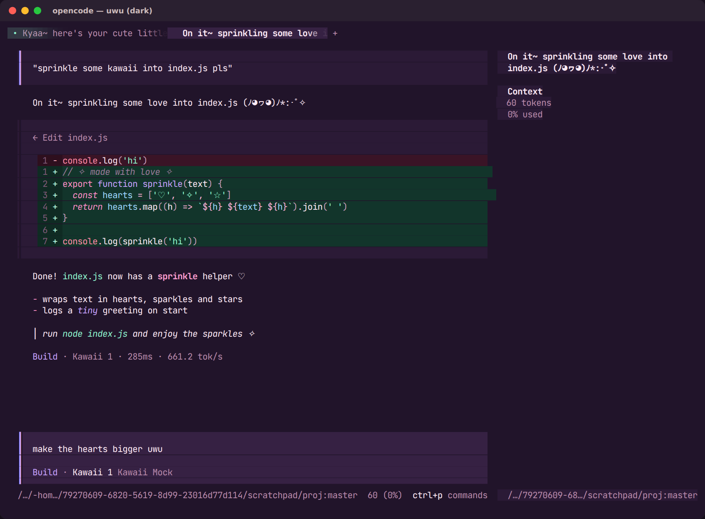
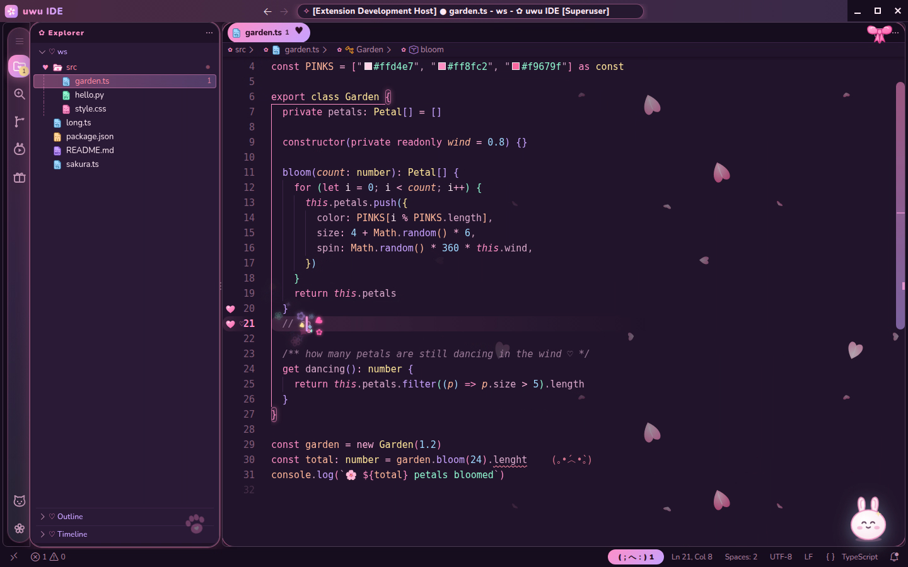

# ♡ uwu ✧

Super duper kawaii themes in one pastel palette (🌙 strawberry-milk night and 🌸 sakura cream
day), with falling sakura wherever we can get away with it.



## What's inside

| | | |
| --- | --- | --- |
| **opencode** | [**web**](opencode/web/) | Firefox `userContent.css` for the opencode v2 web UI: falling sakura, gradient bubbles, a rainbow composer, bouncy everything |
| | [**tui**](opencode/tui/) | Terminal theme for the opencode v2 TUI (`uwu` and `uwu-transparent`) |
| **VS Code** | [**uwu IDE**](vscode/) | VS Code extension that turns VS Code into a kawaii IDE: themes, file icons, sakura petals, a full window makeover with splash screen, mascot, sparkles and confetti |

## Repo layout

```
opencode/
  web/          Firefox userContent.css for the opencode web UI
  tui/          opencode TUI themes
vscode/
  uwu-code/     the VS Code extension (source)
  uwu-code-0.2.0.vsix   ready-to-install package
tools/          generators shared by everything above
  palette.py      the shared colour palette
  petals.py       falling-sakura SVG tiles (web + VS Code)
  tui_theme.py    builds the opencode TUI themes
  vscode_theme.py builds the VS Code colour themes
  kawaii_assets.py draws the uwu IDE icons, mascot and file icons
```

Each section has its own README with install steps and screenshots.

| opencode web | opencode TUI | VS Code |
| --- | --- | --- |
|  |  |  |
