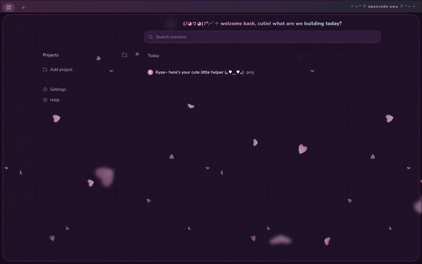
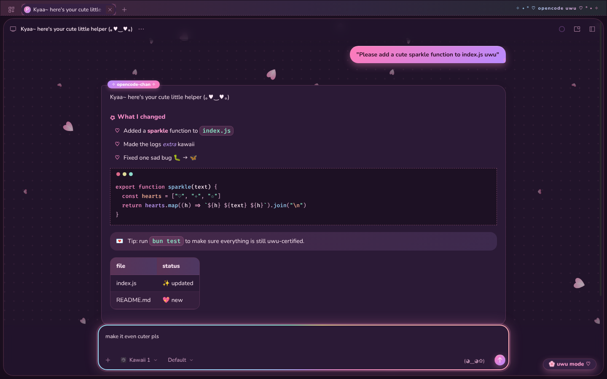
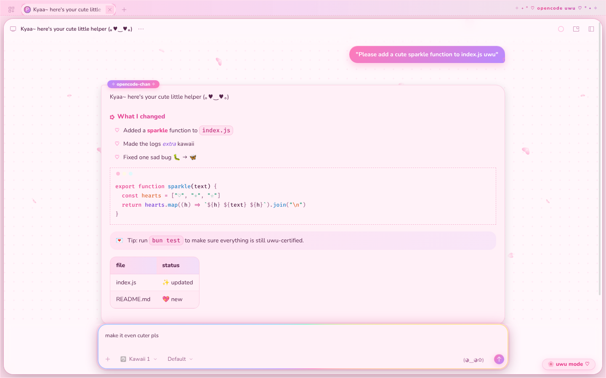
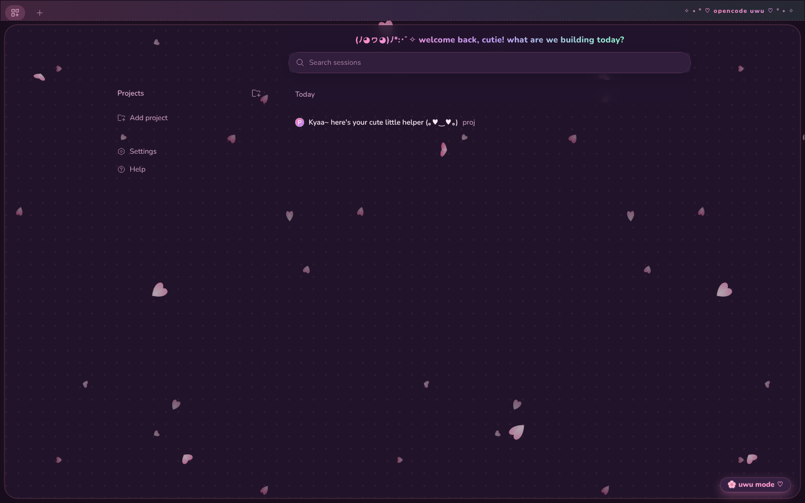

# ♡ opencode-web-uwu ✧

A super duper kawaii theme for **OpenCode v2** (`@opencode/cli` 2.x):

- **Web UI:** a Firefox `userContent.css`, with no extensions needed
- **TUI:** a matching terminal theme (jump to [TUI theme](#tui-theme-))



▶ The full 20-second, 60fps demo is [`screenshots/uwu-demo.mp4`](screenshots/uwu-demo.mp4).

| 🌙 Strawberry-milk night | 🌸 Sakura cream day |
| --- | --- |
|  |  |
|  |  |

## What you get

- Pastel pink / lavender / mint palette for **both** dark and light mode (follows OpenCode's own scheme toggle)
- Rounded **Nunito** font and **Fira Code** for code
- Gradient chat bubbles, an "opencode-chan" badge on replies, and ♡ list bullets
- Pastel syntax highlighting and "window dots" on code blocks
- Glowing rounded composer, gradient send/connect buttons, and bouncy hover effects
- **Falling sakura petals in the wind 🌸.** There are three layers: a far one with small, slow petals, a near one with bigger petals, and a front one with a few big, blurry petals for depth. Each petal falls, sways, spins and flips, and the wind blows them sideways in gusts. The petals fall *behind* the chat cards, so text stays readable.
- **Fun animations:**
  - new messages pop in
  - a rainbow border spins around the composer while you type
  - the send button does a heartbeat
  - your chat bubble gets a shimmer
  - the title-bar text shimmers
  - the ✿ before headings spins
  - icon buttons wiggle, the code-block dots twinkle, and home rows slide in
- Polka-dot background, a welcome banner on the home page, and a heart cursor
- Respects `prefers-reduced-motion`, which turns off all animation, petals included

## Install (Firefox)

1. Open `about:config`, then set
   `toolkit.legacyUserProfileCustomizations.stylesheets` → `true`.
2. Open `about:profiles`. Under the profile you use, click **Open Directory**
   next to *Root Directory*.
3. Create a folder named `chrome` there if it doesn't exist.
4. Copy [`chrome/userContent.css`](chrome/userContent.css) into that folder.
   If you already have a `userContent.css`, paste this file's contents at the end of it.
   Keep the `@import` line at the very top of the file.
5. Restart Firefox, then open your OpenCode web UI (`opencode serve`, or wherever
   your OpenCode server runs).

> **Tip:** You can use a dedicated profile for OpenCode, e.g.
> `firefox -P opencode --new-instance http://127.0.0.1:4096`.

## How it's scoped

All rules are nested under `:root:has(#oc-theme-preload-script)`. Only the OpenCode
web app ships that script tag, so the theme follows OpenCode to any host or port and leaves
other sites alone. It needs Firefox 121 or later for `:has()` and CSS nesting.

The theme mostly overrides OpenCode v2's own design tokens (`--v2-*`, `--syntax-*`), so
it should survive most UI updates.

## Tweaking the petals

There's one knob near the top of `userContent.css`:

```css
--uwu-petal-opacity: 1;   /* 0 = no petals, .5 = subtler */
```

All the petal motion, wind included, runs inside the SVGs. Animating CSS
`background-position` on such large backgrounds made browsers stutter. To change the wind
(`WIND`; lower = windier), the number of petals, their size, colours or fall speed, edit
`WIND` / `LAYERS` / `PINKS` in
[`tools/petals.py`](tools/petals.py) and run `python3 tools/petals.py`. It regenerates
the petal block inside `userContent.css`.

To drop just the blurry front petals, remove the `"--uwu-petals-front"` entry from `LAYERS`
and remove `var(--uwu-petals-front),` from the petal `background-image` line, then re-run the script.

## TUI theme 🖥️

| 🌙 dark | 🌸 light |
| --- | --- |
|  |  |
|  |  |

The same strawberry-milk / sakura-cream palette, as an opencode terminal theme. There are two
variants:

- **`uwu`:** full theme with its own plum (dark) or cream (light) background
- **`uwu-transparent`:** the same colours, but your terminal's own background shows through, which
  is nice if you have a background image or blur

### Install

1. Copy the theme files into your opencode config's `themes` folder (on macOS and Linux that's
   `~/.config/opencode/themes/`):

   ```sh
   mkdir -p ~/.config/opencode/themes
   cp tui/themes/*.json ~/.config/opencode/themes/
   ```

   You can also put them in a project's `.opencode/themes/` folder to use them only there.
2. Pick it in opencode with `/themes`, or set it in `~/.config/opencode/cli.json`:

   ```json
   {
     "$schema": "https://opencode.ai/v2/cli.json",
     "theme": { "name": "uwu", "mode": "system" }
   }
   ```

   `mode` can be `system` (follows your terminal), `dark`, or `light`.

You'll need a truecolor terminal (most modern terminals). Inside tmux, add
`set -as terminal-features ',*:RGB'`.

To tweak colours, edit the palette in [`tools/tui_theme.py`](tools/tui_theme.py) and run
`python3 tools/tui_theme.py`. It uses the same colours as the web theme. One known limit:
markdown table borders stay neutral grey, because opencode v2 doesn't expose that colour to themes.

## Fonts offline?

The theme loads Nunito and Fira Code from Google Fonts. If you'd rather not fetch
anything, delete the `@import` line and install the fonts locally. The font stack falls back to
`M PLUS Rounded 1c`, `Quicksand`, `Varela Round`, and then your system UI font.
