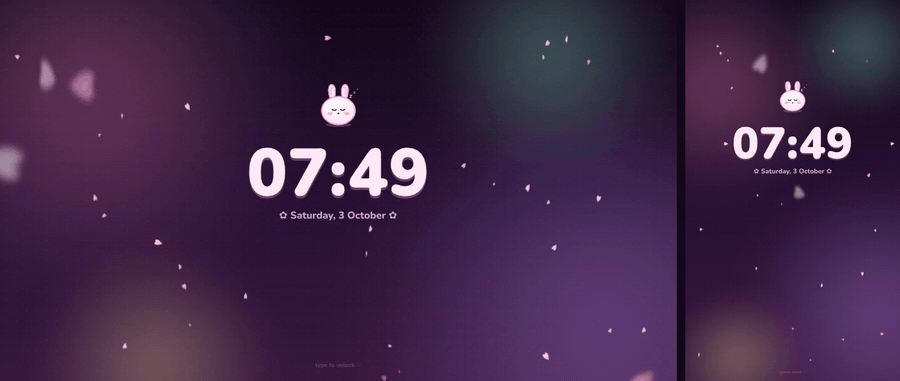
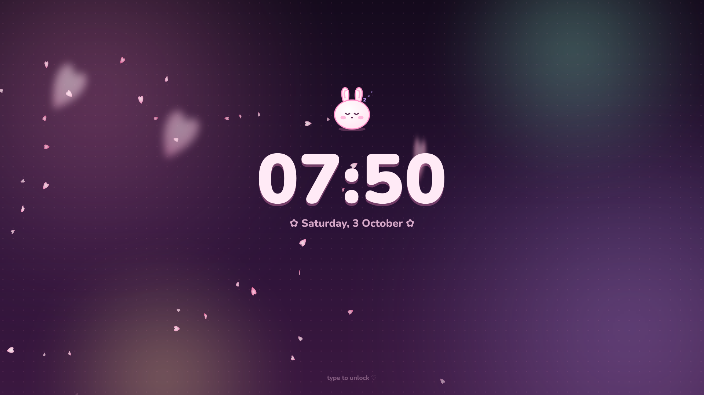
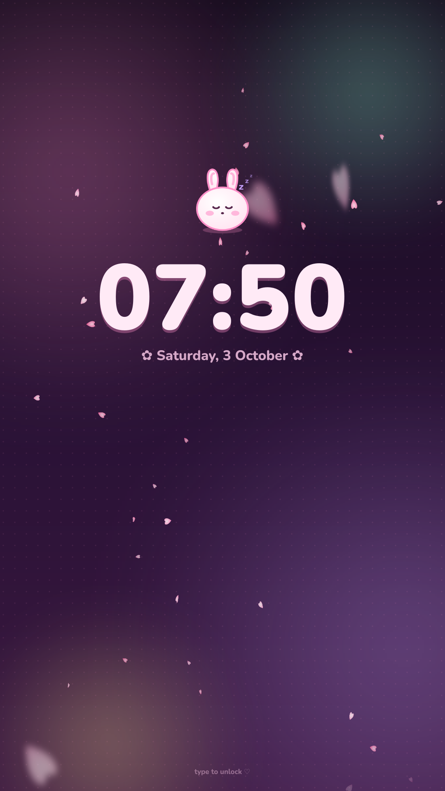
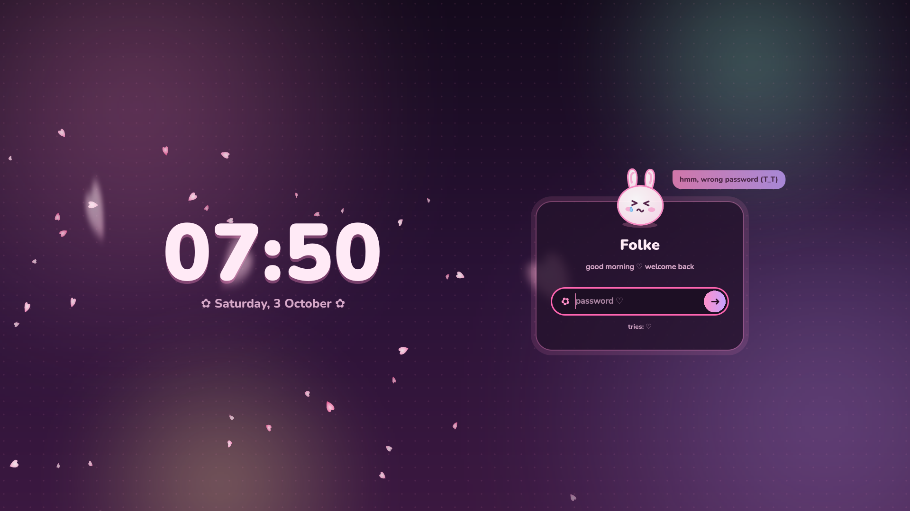
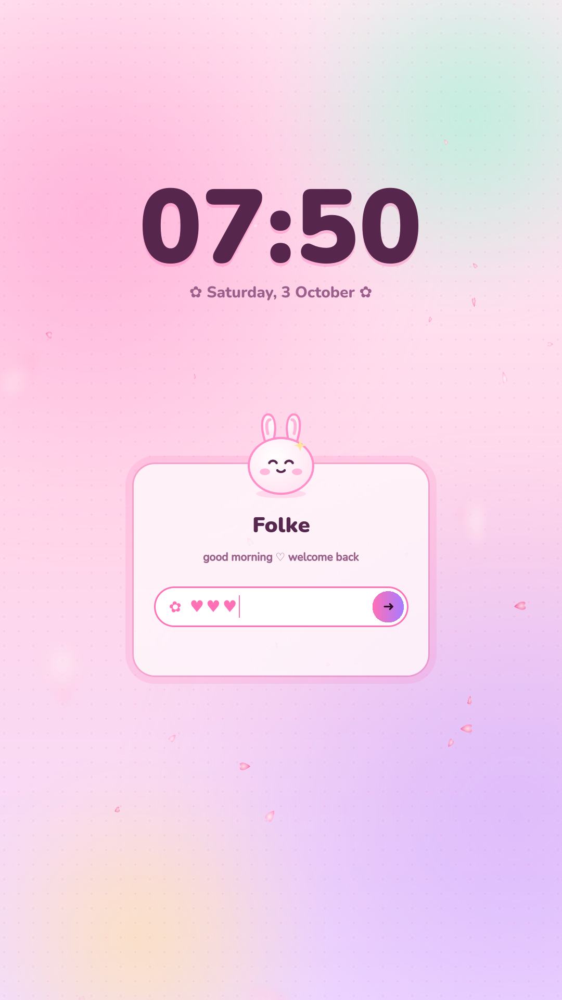
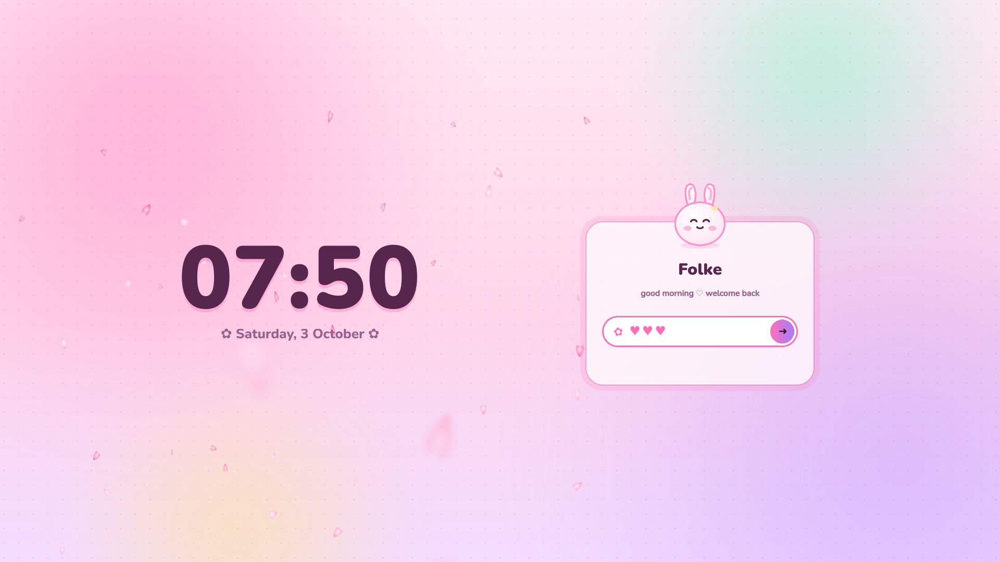

# ♡ uwu lock screen ✧

A kawaii lock screen for **KDE Plasma 6** (6.1 or newer, so current Arch). It's the screen you get when you lock
your session. It matches uwu-term and the uwu IDE: same pastel palette, falling sakura and the same mochi bunny.



([video](screenshots/uwu-lock-demo.mp4): a normal screen on the left, a monitor turned 90° on the right)

## What it does

- 🌸 **Sakura petals** drift down on a gusty breeze, with a few big soft ones floating closer to you.
- 🐰 **A bunny with moods**:
  - It **sleeps** (zzz) while the screen is idle.
  - It wakes up with a hop when you touch the keyboard or mouse.
  - It **pouts** and wobbles at a wrong password, and the card shakes.
  - It goes **heart-eyed** with a burst of hearts when you get in.
- 🔐 **Password field**: your password shows as little ♥ hearts and every key pops a heart or sparkle. Caps lock gets a
  warning, and after a few failed tries you get some gentle encouragement.
- 🕰 **Idle mode**: after 12 seconds only the big clock and the sleeping bunny stay. You don't have to click anything
  first; just start typing your password and the card fades back in.
- 🌙 / 🌸 **Night and day colours**, or your own wallpaper under a pastel tint.
- 💤 **Sleep, hibernate and switch user** buttons, when your system allows them.

### Rotated (portrait) monitors

Plasma puts a separate lock screen on every monitor, sized to that monitor. When a screen is taller than it is wide
(a monitor turned 90°), the layout switches on its own:

- The clock moves to the top and the card sits underneath.
- Both get bigger, so they use the tall screen well.

Mixed setups work too, for example a normal monitor next to a rotated one.

| Landscape | Portrait (monitor turned 90°) |
| --- | --- |
|  |  |
|  |  |
|  |  |
|  | |

## Install

```sh
git clone https://github.com/folkedevvy/opencode-web-uwu.git
cd opencode-web-uwu/kde/lockscreen
./install.sh
```

No root needed, and nothing outside your home folder is touched. Then lock your screen to see it.

**Try it without locking anything:** run Plasma's own test mode. It shows the lock screen in a window, and your real
password closes it (or press Ctrl+C in the terminal):

```sh
/usr/lib/kscreenlocker_greet --testing
```

### The shortcut

Plasma locks with **Meta+L**, and also Ctrl+Alt+L. Plain Ctrl+L isn't a lock shortcut by default, because apps use it
(for example, to jump to the address bar). To change it, go to *System Settings → Keyboard → Shortcuts → Session
Management → Lock Session*.

### Settings

Go to *System Settings → Screen Locking → Appearance → Configure…*. The options are:

| Setting | Default | |
| --- | --- | --- |
| Colours | night | 🌙 strawberry-milk night or 🌸 sakura cream day |
| Background | gradient | or your lock screen wallpaper under a pastel tint (pick the wallpaper on the same page) |
| Sakura | on, 40 petals | 0 – 120 |
| Calm mode | off | no petals or drifting background |

## Remove

```sh
~/.local/share/uwu-lockscreen/uninstall.sh
```

Plasma's own lock screen comes straight back.

## How it works (and why it's safe)

Since Plasma 6.1 the lock screen isn't part of the global theme any more. It lives inside Plasma's desktop shell
package (`org.kde.plasma.desktop`), and KDE only lets you override a package as a whole. So `install.sh` does this:

1. Puts this lock screen in `~/.local/share/uwu-lockscreen/`.
2. Makes your own copy of the desktop shell package in `~/.local/share/plasma/shells/org.kde.plasma.desktop/`, with
   only the `lockscreen/` folder swapped for ours.
3. Keeps that copy in sync with Plasma updates, so the rest of your desktop always runs the current Plasma files. The
   sync runs at every login (from `~/.config/plasma-workspace/env/`) and again right after Plasma updates (a systemd
   user path unit). It finishes instantly when nothing changed.

Your panels and widgets are untouched; their settings live elsewhere. The installer also refuses to run if you already
have your own copy of that package.

**Can't get in?** That shouldn't happen. If the lock screen's QML ever fails to load, Plasma automatically shows its
own built-in fallback lock screen. If you're ever stuck anyway:

1. Press Ctrl+Alt+F3 and log in.
2. Run `loginctl unlock-session`.
3. Run `~/.local/share/uwu-lockscreen/uninstall.sh`.

## Preview and development

`preview/preview.py` loads the lock screen the way Plasma's greeter does, with a fake password check (the password is
`uwu`). It's handy for trying changes without locking:

```sh
pip install PySide6
python3 preview/preview.py                    # 1280x720
python3 preview/preview.py --size 1080x1920   # a monitor turned 90°
python3 preview/preview.py --theme day
```

| File | |
| --- | --- |
| `lockscreen/LockScreen.qml` | entry point (what the greeter loads) |
| `lockscreen/UwuLock.qml` | layout, password handling, idle/awake |
| `lockscreen/Bunny.qml`, `Petals.qml`, `Petal.qml`, `Pill.qml` | the bunny, the sakura and buttons |
| `lockscreen/Sessions.qml`, `CapsLock.qml` | KDE-only extras, loaded so that a missing module can't break the lock screen |
| `lockscreen/config.xml`, `config.qml` | the settings page |
| `lockscreen/assets/` | drawn by `tools/lockscreen_assets.py` |

The font is [Nunito](https://fonts.google.com/specimen/Nunito) (SIL Open Font License, see `lockscreen/fonts/OFL.txt`).
