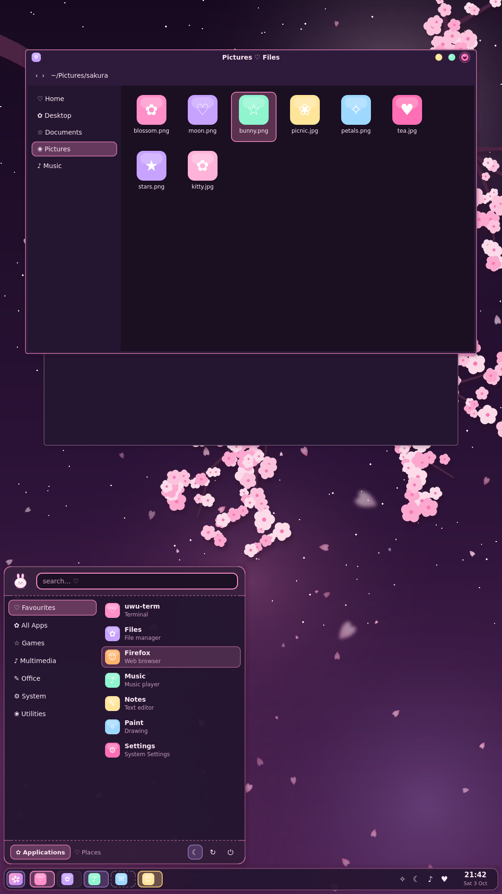
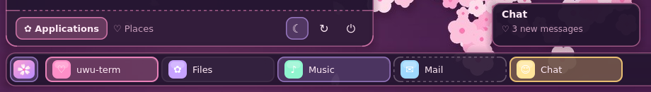
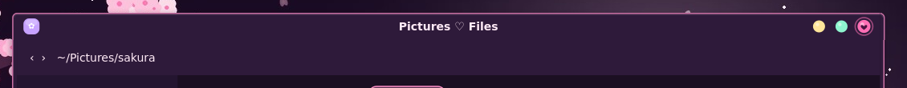
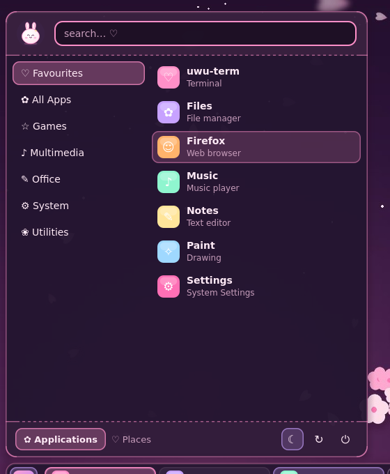
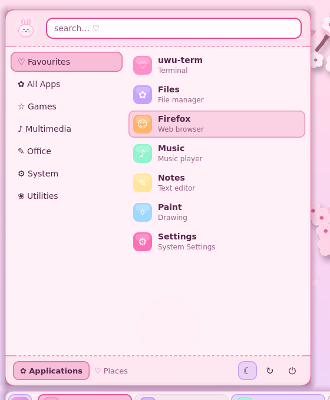
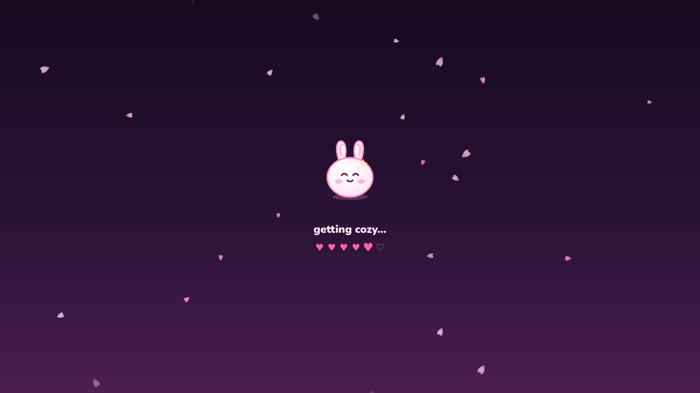

# ♡ uwu for KDE Plasma ✧

Makes the whole logged-in Plasma desktop kawaii: the task bar, start menu, popups, tooltips, window title bars, colours,
wallpaper and the splash screen while you log in. It's the same pastel family as the
[uwu lock screen](../lockscreen/), uwu-term and the uwu IDE.


| 🌸 uwu day | rotated (portrait) monitor |
| --- | --- |
|  |  |

## What changes

| | |
| --- | --- |
| **Task bar** | A rounded candy panel. Window buttons are pastel pills: pink for the active window, lavender on hover, butter yellow when an app wants attention, and a dashed "ghost" outline for minimised windows. |
| **Start menu** | Rounded popup with a soft glow, pink dashed dividers, a pill-shaped search field, and candy highlights on hover and selection. The start button becomes the uwu sakura icon. |
| **Popups & tooltips** | System tray, calendar, volume and notifications all get the same rounded, pink-edged look with a soft plum shadow. |
| **Window title bars** | Rounded, pastel, with candy buttons (🟡 minimise, 🟢 maximise, 💗 close) that show a little glyph on hover; the close button gets a heart. |
| **Colours** | `uwu night` (strawberry-milk night) and `uwu day` (sakura cream) colour schemes for every app: Dolphin, System Settings, Kate and the rest of your KDE apps. |
| **Wallpaper** | "uwu sakura": a blossoming branch under a moon (night) or sun (day). It comes in landscape, ultrawide and **portrait** sizes, so a monitor turned 90° gets its own tall picture. |
| **Splash screen** | The bunny hops while Plasma starts, and the hearts fill up. |

| | |
| --- | --- |
|  |  |
|  |  |



## Install

> **Quick way:** `./uwu.sh install plasma` (or `--day`) from the repo root.

Needs Plasma 6.

```sh
git clone https://github.com/folkedevvy/opencode-web-uwu.git
cd opencode-web-uwu/kde/plasma
./install.sh          # uwu night
./install.sh --day    # uwu day
```

No root needed; everything goes into `~/.local/share`. The installer:
- saves your current colours, Plasma style, window decoration and splash screen
- switches to uwu
- sets the start menu icon

Your panels, widgets and their layout are left alone.

Options:
- `--no-apply` only installs. You can then mix and match in *System Settings → Colours & Themes*: Global Theme, Colours,
  Plasma Style, Window Decorations, Splash Screen.
- `--keep-launcher-icon` leaves your start menu icon as it is.

**Switch between night and day** in *System Settings → Colours & Themes → Global Theme*. The Plasma style follows the
colour scheme, so picking just the *uwu day* colours turns the panel and popups pastel-light too.

**Pair it with the [uwu lock screen](../lockscreen/)** for the full set.

## Remove

```sh
~/.local/share/uwu-plasma/uninstall.sh
```

This puts back the colours, Plasma style, window decoration and splash screen you had before, then deletes the theme
files. The wallpaper stays until you pick another one.

## Notes

- Panel thickness and floating are your choice: the theme works with both floating and full-width panels.
- The title bar's side borders follow *System Settings → Window Decorations → Border size*. The theme looks best at
  "Normal".
- Icons and the cursor are left as they are; a soft, rounded icon theme (Papirus, for example) suits it.

## How it's made

Everything is generated from code, so it's easy to tweak:

| | |
| --- | --- |
| `tools/plasma_theme.py` | colour schemes, the Plasma style SVGs, window decorations, start menu icon |
| `tools/plasma_extras.py` | wallpaper (all sizes), splash screen, the two global themes |
| `preview/preview.py` | renders a mock desktop with the real theme files, the way Plasma draws them (that's where the screenshots come from) |

The screenshots come from that preview, not from a real Plasma session. The task bar, start menu, window contents and
icons in them are mock-ups, drawn around the real theme files.

The Plasma style uses Plasma's colour-scheme classes, so its colours always match the active colour scheme.
