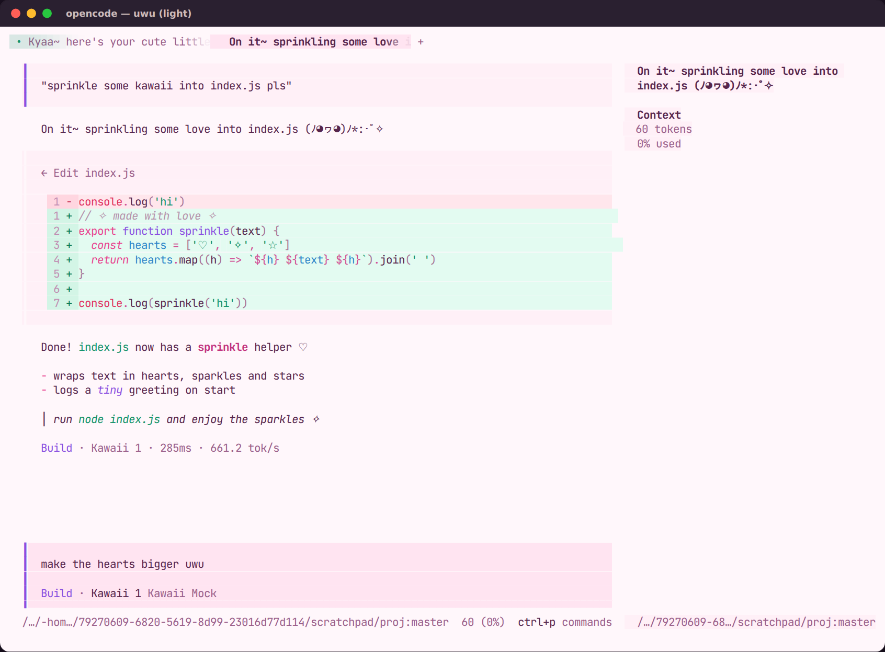
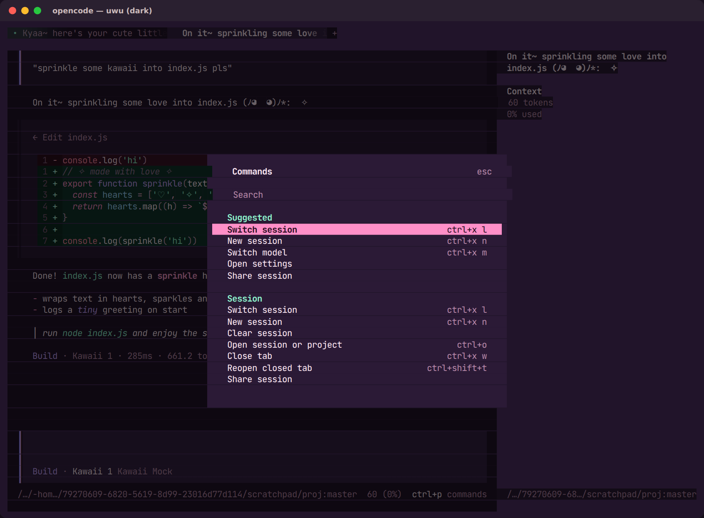
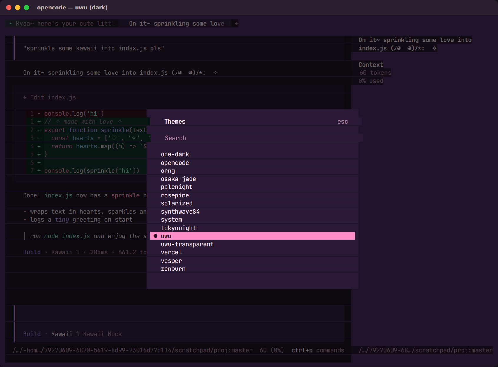

# ♡ uwu for the opencode TUI ✧

A matching terminal theme for the **opencode v2 TUI** (`@opencode/cli` 2.x).

| 🌙 dark | 🌸 light |
| --- | --- |
|  |  |
|  |  |

The same strawberry-milk / sakura-cream palette, as an opencode terminal theme. There are two
variants:

- **`uwu`:** full theme with its own plum (dark) or cream (light) background
- **`uwu-transparent`:** the same colours, but your terminal's own background shows through, which
  is nice if you have a background image or blur

## Install

> **Quick way:** `./uwu.sh install tui` from the repo root.

1. Copy the theme files into your opencode config's `themes` folder (on macOS and Linux that's
   `~/.config/opencode/themes/`):

   ```sh
   mkdir -p ~/.config/opencode/themes
   cp opencode/tui/themes/*.json ~/.config/opencode/themes/   # from the repo root
   ```

   You can also put them in a project's `.opencode/themes/` folder to use them only there.
2. Pick it in opencode with `/themes`, or set it in `~/.config/opencode/cli.json`:

   ```json
   {
     "$schema": "https://opencode.ai/v2/cli.json",
     "theme": { "name": "uwu", "mode": "system" }
   }
   ```

   `mode` can be `system` (follows your terminal), `dark`, or `light`.

You'll need a truecolor terminal (most modern terminals). Inside tmux, add
`set -as terminal-features ',*:RGB'`.

## Tweaking

To tweak colours, edit the shared palette in [`tools/palette.py`](../../tools/palette.py) and run
`python3 tools/tui_theme.py` from the repo root. The VS Code theme uses the same palette. One known limit:
markdown table borders stay neutral grey, because opencode v2 doesn't expose that colour to themes.
