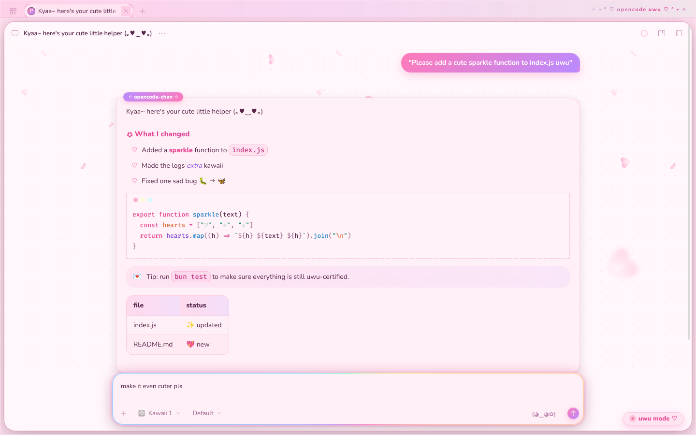
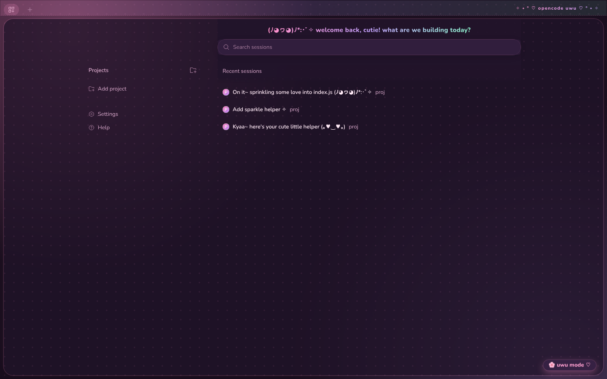
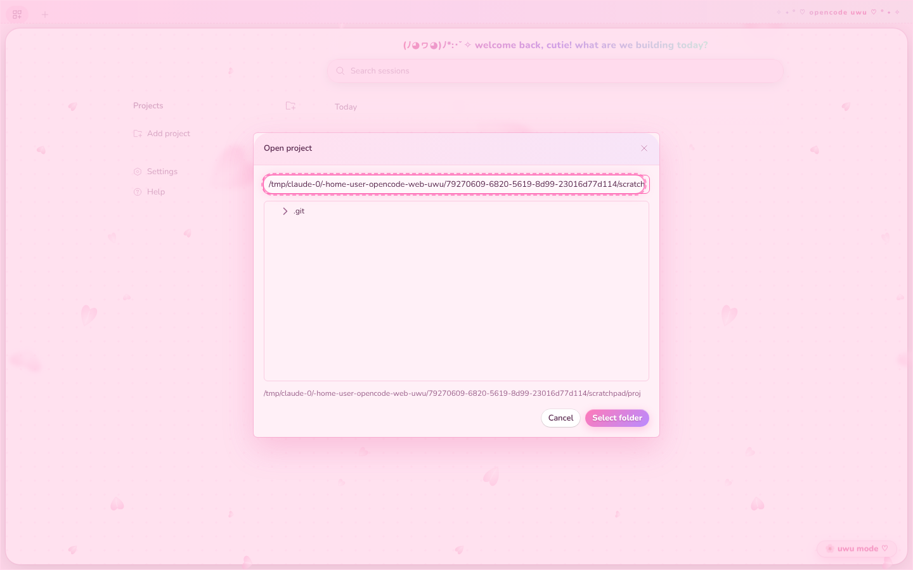

# ♡ uwu for the opencode web UI ✧

A Firefox `userContent.css` that makes the **opencode v2 web UI** (`@opencode/cli` 2.x)
super duper kawaii, with falling sakura included. No extensions needed.


▶ The full 20-second, 60fps demo is [`screenshots/uwu-demo.mp4`](screenshots/uwu-demo.mp4).

| 🌙 Strawberry-milk night | 🌸 Sakura cream day |
| --- | --- |
|  |  |
|  |  |

## What you get

- Pastel pink / lavender / mint palette for **both** dark and light mode (follows OpenCode's own scheme toggle)
- Rounded **Nunito** font and **Fira Code** for code
- Gradient chat bubbles, an "opencode-chan" badge on replies, and ♡ list bullets
- Pastel syntax highlighting and "window dots" on code blocks
- Glowing rounded composer, gradient send/connect buttons, and bouncy hover effects
- **Falling sakura petals in the wind 🌸.** Small far petals, bigger near ones, and a few big, blurry petals for depth, tumbling at different angles and swaying in the breeze. They fall *behind* the chat, which is slightly see-through so you can still see them, and text stays readable.
- **Fun animations:**
  - new messages pop in
  - the composer gets a rainbow border while you type
  - the send button does a heartbeat
  - your chat bubble shimmers as it arrives
  - the title-bar text shimmers when you hover it
  - the ✿ before headings spins
  - icon buttons wiggle, the code-block dots twinkle, and home rows slide in
- Polka-dot background, a welcome banner on the home page, and a heart cursor
- Respects `prefers-reduced-motion`, which turns off all animation, petals included

## Install (Firefox)

> **Quick way:** `./uwu.sh install web` from the repo root does all of this (for every Firefox profile), and
> `./uwu.sh uninstall web` takes it back out.

1. Open `about:config`, then set
   `toolkit.legacyUserProfileCustomizations.stylesheets` → `true`.
2. Open `about:profiles`. Under the profile you use, click **Open Directory**
   next to *Root Directory*.
3. Create a folder named `chrome` there if it doesn't exist.
4. Copy [`chrome/userContent.css`](chrome/userContent.css) into that folder.
   If you already have a `userContent.css`, paste this file's contents at the end of it.
   Keep the `@import` line at the very top of the file.
5. Restart Firefox, then open your OpenCode web UI (`opencode serve`, or wherever
   your OpenCode server runs).

> **Tip:** You can use a dedicated profile for OpenCode, e.g.
> `firefox -P opencode --new-instance http://127.0.0.1:4096`.

## How it's scoped

All rules are nested under `:root:has(#oc-theme-preload-script)`. Only the OpenCode
web app ships that script tag, so the theme follows OpenCode to any host or port and leaves
other sites alone. It needs Firefox 121 or later for `:has()` and CSS nesting.

The theme mostly overrides OpenCode v2's own design tokens (`--v2-*`, `--syntax-*`), so
it should survive most UI updates.

## Tweaking the petals

There's one knob near the top of `userContent.css`:

```css
--uwu-petal-opacity: 1;   /* .5 = subtler (for no petals, use calm mode below) */
```

The petals are still pictures, and the whole layer slides with a CSS `transform` animation. Speed and breeze are
the `uwu-fall` (20s per loop) and `uwu-breeze` animations in the petals section of `userContent.css`. To change
the number of petals, their size or colours, edit `LAYERS` / `PINKS` in
[`tools/petals.py`](../../tools/petals.py) and run `python3 tools/petals.py` from the repo root. It regenerates
the petal block inside `userContent.css`.

To drop just the blurry front petals, remove `var(--uwu-petals-front),` from the petal `background-image` line
(and its `1000px 1000px,` from `background-size`).

## Performance

The theme is built so Firefox animates almost everything on the compositor (`transform` and `opacity` only). Nothing
repaints the page every frame:
- **Petals:** one layer of still pictures that slides as a whole.
- **No backdrop blur anywhere:** opencode keeps an invisible blurred drop-zone over the chat, and anything moving
  behind a blur forces it to be recomputed every frame.
- **Main-thread effects run briefly:** the bubble shimmer plays only as a message arrives, and the title-bar rainbow
  only on hover.

Measured in Firefox 157 on an opencode chat page, with software rendering. That's the worst case: with GPU
rendering, the remaining petal cost is much smaller.

| | frames per second |
| --- | --- |
| no theme | 60 |
| uwu, before this rework (animated SVG petals) | under 1 |
| uwu now | about 45 |
| uwu now, calm mode (no petals) | 60 |

**Calm mode** (no petals at all, the cheapest it gets): add this line to the end of your `userContent.css`:

```css
:root:has(#oc-theme-preload-script) body::before { display: none !important; }
```

## Fonts offline?

The theme loads Nunito and Fira Code from Google Fonts. If you'd rather not fetch
anything, delete the `@import` line and install the fonts locally. The font stack falls back to
`M PLUS Rounded 1c`, `Quicksand`, `Varela Round`, and then your system UI font.
