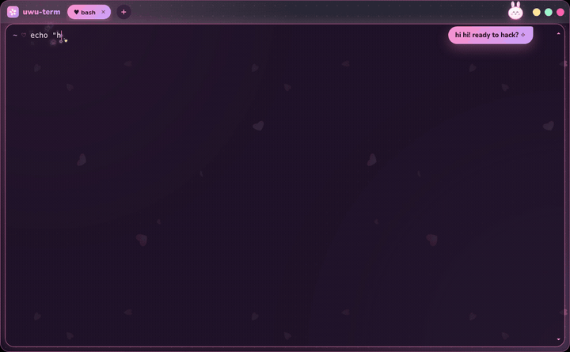
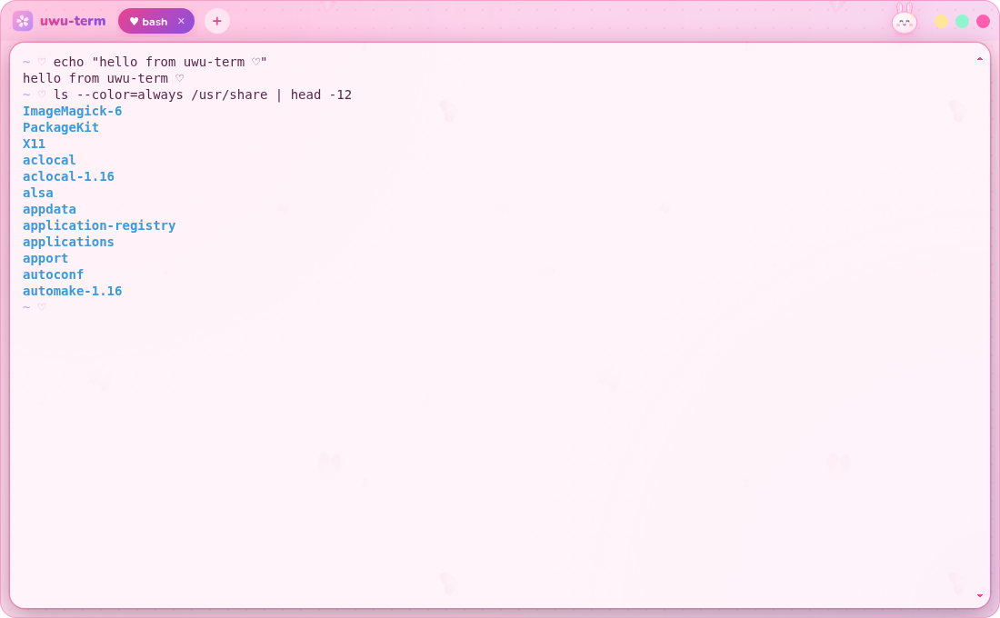
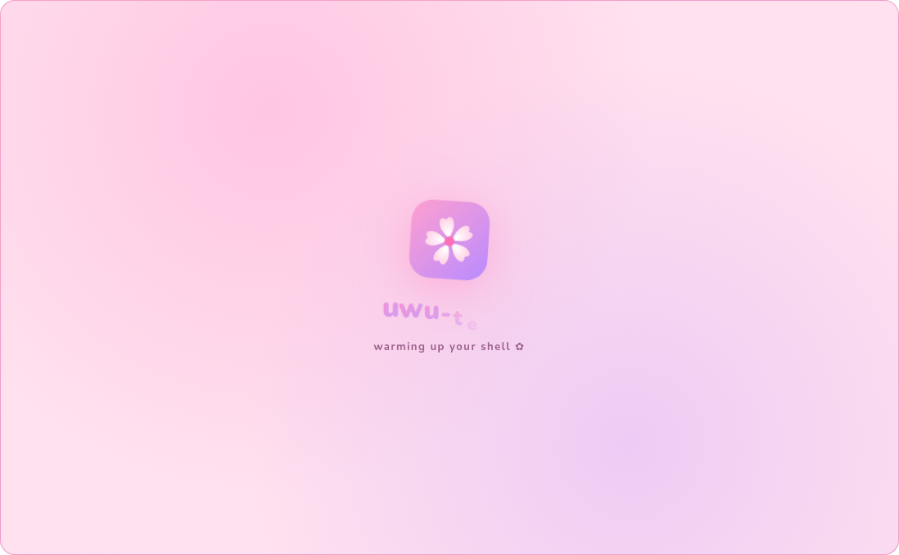
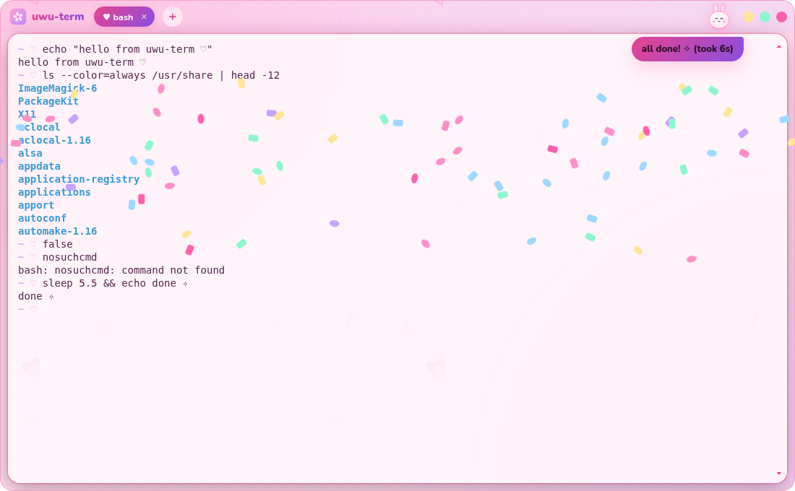

# ♡ uwu-term ✧

A super duper kawaii terminal emulator, made for **Arch + KDE Plasma on Wayland**.
It is the uwu IDE's sibling: the same pastel palette, sakura petals drifting behind a
glassy terminal card, candy tab pills, and a bunny mascot that reacts to your
commands.



([full 30s video](screenshots/uwu-term-demo.mp4))

| 🌙 strawberry-milk night | 🌸 sakura cream day |
| --- | --- |
|  |  |
|  |  |

## Things it does

- 🌸 **Sakura petals** drift behind a translucent terminal card, and the window's corners are rounded.
- 🐰 **A bunny mascot** in the title bar:
  - It **hops** when things go well.
  - It **pouts** and says what went wrong when a command fails ("command not found?", "exit 1").
  - It cheers "fixed it!" when your next command works.
  - It throws **confetti** when a long command (5s or more) finishes OK.
  - Pat it for compliments ♡
- ✧ **Sparkles** while you type, click bursts, hearts on the terminal bell.
- 🍬 **Candy tabs**: a busy tab gets a spinning ✧ while a command runs. New tabs open in the current folder.
- 🌙/🌸 **Follows Plasma's light/dark setting** live, or pin one theme.
- Pastel ANSI colours, truecolor, clickable links, WebGL rendering (falls back to DOM rendering when there's no GPU).
- A boot splash, a kawaii right-click menu, zoom with Ctrl +/−.

The mascot's reactions use **shell integration** (OSC 133 + OSC 7) for **bash, zsh and fish**.
It's loaded automatically, and your own `~/.bashrc` / `~/.zshrc` / fish config still load as usual.

## Install on Arch

> **Quick way (any distro, no root):** `./uwu.sh install term` from the repo root. It builds uwu-term
> into `~/.local/share` and adds it to your app launcher.

```sh
git clone https://github.com/folkedevvy/opencode-web-uwu.git
cd opencode-web-uwu/terminal/uwu-term/packaging/arch
makepkg -si
```

This builds **uwu-term-git**, which:
- runs on Arch's own `electron` package, so no Electron is bundled
- installs `uwu-term`, a desktop entry (it shows up under System → Terminal in the app launcher) and icons

To make it Plasma's default terminal, go to *System Settings → Default Applications → Terminal Emulator* and pick
**uwu-term**.

### Run from source instead

```sh
cd terminal/uwu-term
npm install      # pulls Electron and builds node-pty (needs base-devel + python)
npm start
```

## Shortcuts

| Keys | |
| --- | --- |
| Ctrl+Shift+C / Ctrl+Shift+V | copy / paste (Shift+Insert also pastes) |
| Ctrl+Shift+T / Ctrl+Shift+W | new tab / close tab |
| Ctrl+Shift+N | new window |
| Ctrl+Tab, Ctrl+PgDn / Ctrl+Shift+Tab, Ctrl+PgUp | next / previous tab |
| Ctrl+= / Ctrl+− / Ctrl+0 | zoom in / out / reset |
| double-click the title bar | maximise |
| right-click | the kawaii menu |

## Config

`~/.config/uwu-term/config.json` is created with the defaults on first run.
Edit it, then restart uwu-term to apply.

| Key | Default | |
| --- | --- | --- |
| `theme` | `"auto"` | `"auto"` follows Plasma; or `"dark"` / `"light"` |
| `shell` | `""` | empty = your login shell (`$SHELL`) |
| `shellArgs` | `[]` | extra arguments for the shell |
| `shellIntegration` | `true` | lets the mascot see commands start/finish (bash, zsh, fish) |
| `fontFamily` | JetBrains Mono, Fira Code, … | any monospace font, Nerd Fonts work |
| `fontSize` / `lineHeight` | `14` / `1.15` | |
| `cursorStyle` | `"bar"` | `"bar"`, `"block"` or `"underline"` |
| `scrollback` | `10000` | lines |
| `opacity` | `0.86` | how solid the terminal card is (the rest shows petals) |
| `petals`, `sparkles`, `clickBursts`, `mascot`, `splash` | `true` | turn each effect on/off |
| `confetti` / `confettiAfter` | `true` / `5` | confetti for successful commands that took at least this many seconds |

If your system asks apps for reduced motion (`prefers-reduced-motion`), all animation stops. You can also switch
each effect off above.

## Wayland notes

- uwu-term runs as a native Wayland client (`--ozone-platform-hint=auto`) and uses X11 automatically elsewhere.
- The window draws its own rounded frame and pastel buttons, and KWin handles moving, snapping and tiling as usual.
- If your Wayland IME (e.g. fcitx5) needs it, put extra Electron flags in `~/.config/uwu-term-flags.conf`,
  one per line. For example:

  ```
  --enable-wayland-ime
  ```

## How it's built

Electron + [xterm.js](https://xtermjs.org/) + [node-pty](https://github.com/microsoft/node-pty).

| File | |
| --- | --- |
| `main.js` | window, config, shells |
| `preload.js` | the small bridge the page may use |
| `renderer/` | the look and every effect |
| `shell/` | integration scripts for bash, zsh and fish |
| `renderer/assets.css`, `assets/icon.svg` | drawn by `tools/kawaii_assets.py`, with the same mascot and petals as the uwu IDE |
