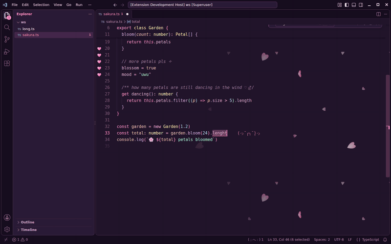
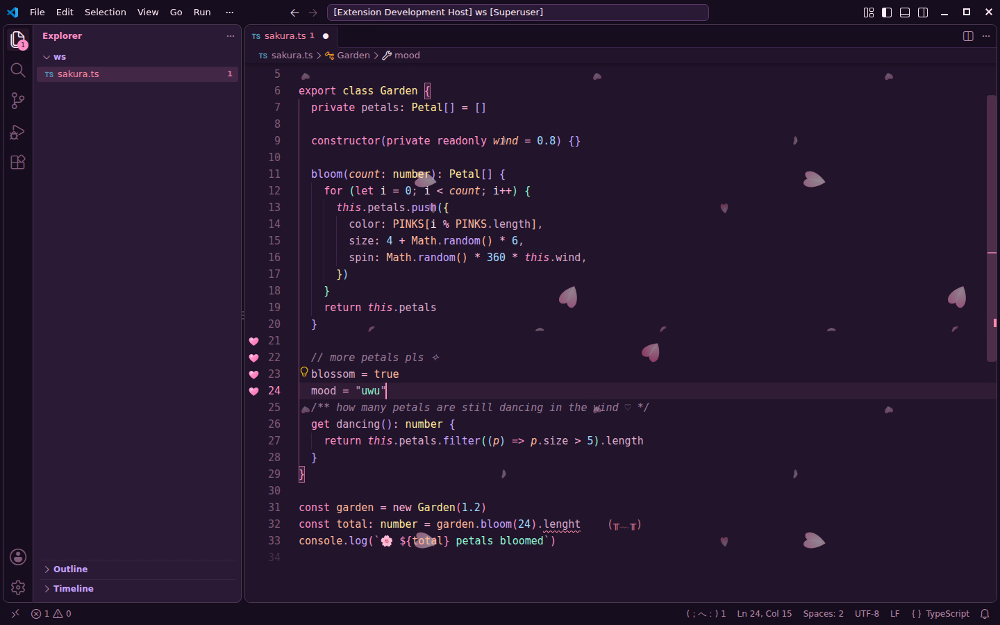
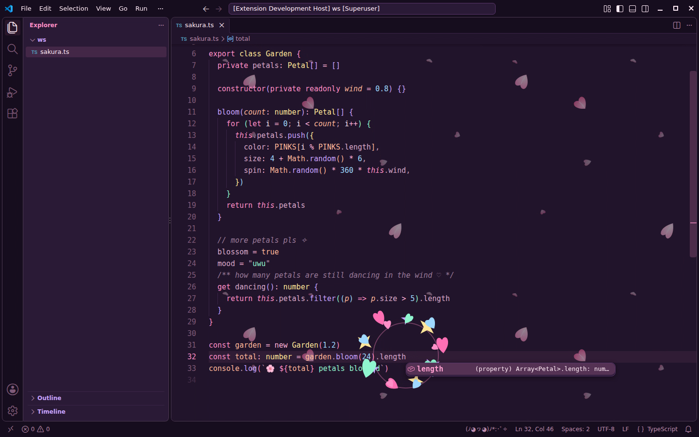
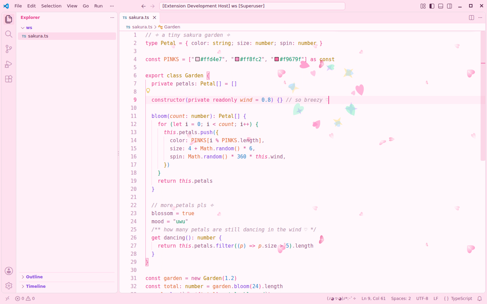

# ♡ uwu-code for VS Code ✧

A VS Code extension with the same pastel palette as the opencode themes. It includes sakura
petals drifting behind your code, a sparkle burst on save, gutter hearts, error kaomoji and a
status-bar mascot.



▶ The full demo is [`screenshots/uwu-code-demo.mp4`](screenshots/uwu-code-demo.mp4). It was recorded in desktop VS Code 1.140
on Linux.

| | |
| --- | --- |
|  |  |
| Gutter hearts on changed lines, a kaomoji on the error line, and the mascot worrying in the status bar | Save → sparkle burst, and the mascot parties |
|  | |
| 🌸 sakura cream day (light theme) | |

## Install (desktop VS Code)

```sh
code --install-extension vscode/uwu-code-0.1.0.vsix   # from the repo root
```

You can also use **Extensions** → `···` → **Install from VSIX…** and pick
[`uwu-code-0.1.0.vsix`](uwu-code-0.1.0.vsix).

Then choose the colour theme: press `Ctrl+K Ctrl+T` and pick **uwu strawberry-milk night** or
**uwu sakura cream day**. The petals, hearts and other effects work with any theme.

See the [extension README](uwu-code/README.md) for every feature and setting. The quick ones:

```jsonc
"uwu.petals.enabled": true,
"uwu.petals.opacity": 0.55,
"uwu.petals.layers": "noFront",  // "far" | "noFront" | "all" (adds big soft petals up front; heavier)
"uwu.sparkleOnSave": true,
"uwu.gutterHearts": true,
"uwu.errorKaomoji": true,
"uwu.mascot": true
```

Click the mascot in the status bar to toggle the petals.

## What it can and can't do

VS Code extensions can only draw inside the editor, so the petals and effects stay there and don't
cover the sidebar, tabs or terminal. The colour theme covers everything else. The petals and burst
rely on a widely used but unofficial decoration trick, so a future VS Code update could break them.
Each effect can be switched off on its own.

## Building from source

```sh
python3 tools/vscode_theme.py      # regenerate the colour themes from tools/palette.py
python3 tools/petals.py            # regenerate the petal tiles (shared with the web theme)
cd vscode/uwu-code && npx @vscode/vsce package --skip-license --out ../uwu-code-0.1.0.vsix
```

To try changes without packaging, run `code --extensionDevelopmentPath=$PWD/vscode/uwu-code`.
