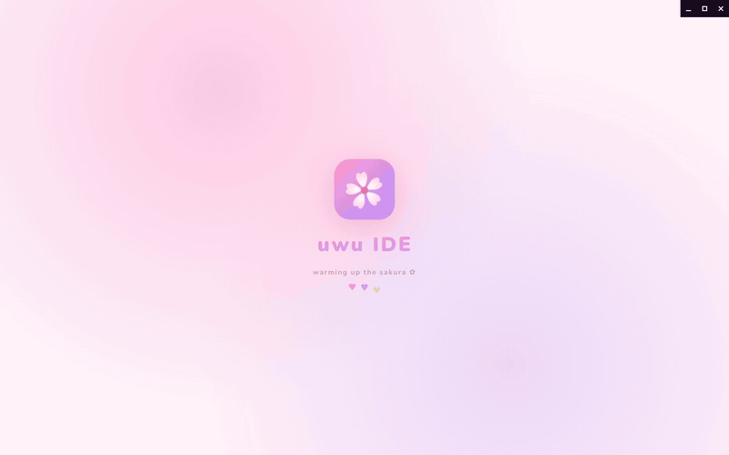
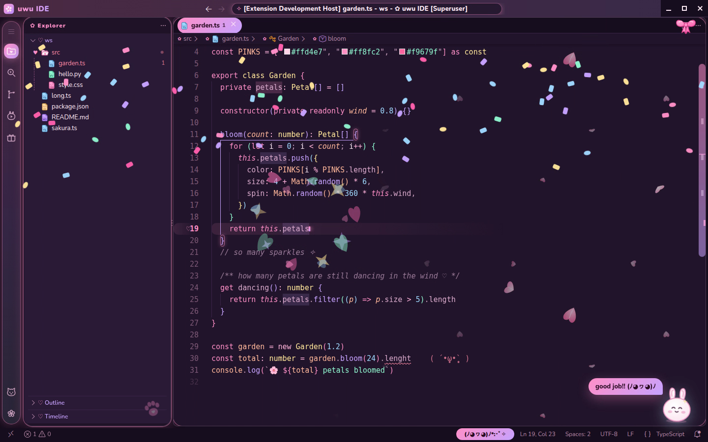
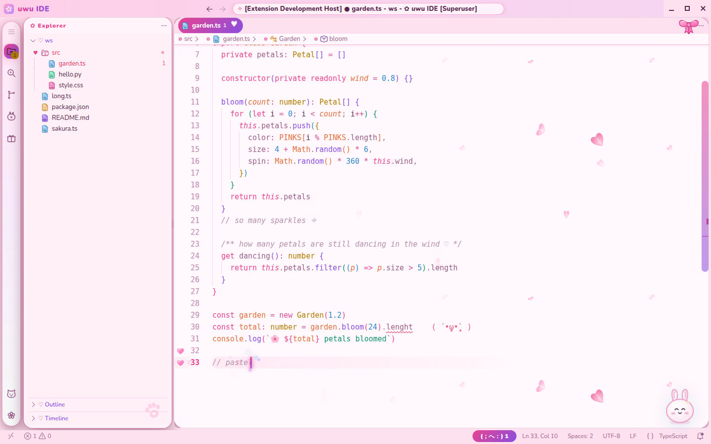
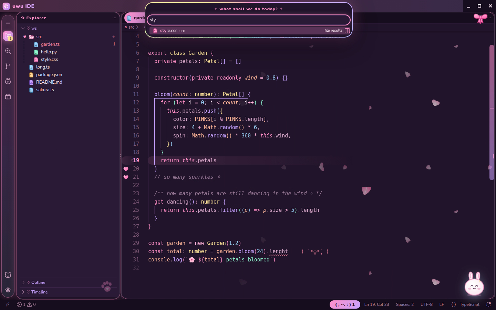
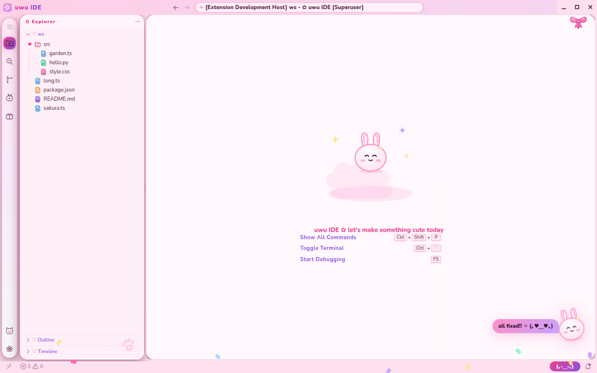

# ♡ uwu IDE ✧ (uwu-code for VS Code)

A VS Code extension that turns VS Code into **uwu IDE**: pastel themes, kawaii file icons, sakura
petals behind your code, and an optional **Kawaii Workbench** that restyles the whole window. It
adds a boot splash, floating candy panels, custom icons, a mascot, sparkles and confetti.



▶ The full demo is [`screenshots/uwu-ide-demo.mp4`](screenshots/uwu-ide-demo.mp4).

| | |
| --- | --- |
|  |  |
| Boot splash | 🌙 strawberry-milk night |
|  |  |
| Save: a sparkle burst, confetti and a happy mascot | 🌸 sakura cream day |
|  |  |
| Command palette with a spinning rainbow border | The empty editor's mascot |

## Two levels of kawaii

**1. The extension on its own.** Install it and pick the theme. It works everywhere, with no
changes to VS Code itself:

- 🌙 / 🌸 colour themes and the **uwu cuties** file icons
- sakura petals behind your code, a sparkle burst on save, gutter hearts, error kaomoji, and the
  status-bar mascot

**2. The Kawaii Workbench (opt-in).** Run **`uwu: Enable Kawaii Workbench`** from the Command
Palette, then reload. Here's what it adds:

| | |
| --- | --- |
| **Window** | A boot splash. Floating, rounded candy panels on a dotted pastel window, with petals drifting across the whole window. |
| **Look** | The rounded Nunito font everywhere. A gradient title bar with the "uwu IDE" brand. |
| **Icons & stickers** | Custom-drawn icons in a floating dock (a folder-heart, a cat face, a sakura for settings…). Bow and paw stickers. |
| **Tabs & lists** | Candy-pill tabs, with a beating ♥ on unsaved files. ♡ / ♥ tree arrows, and icons that wiggle on hover. |
| **Popups** | A command palette with a spinning rainbow border. Bouncy menus, speech-bubble notifications, and dialogs with the mascot. |
| **Effects** | Heart bursts wherever you click, sparkles out of the cursor while you type, and confetti when you save. |
| **Mascot** | A floating mochi bunny that blinks, cheers, worries about errors, gives tips and loves pats. |
| **Editor** | A glowing gradient caret and a soft current-line glow. The mascot replaces the VS Code logo in the empty editor. |

It also sets a few editor options for the full look: the compact menu, a smooth caret, no
minimap, and so on. It only sets ones you haven't set yourself, and it puts them back when you disable it.

### How the Kawaii Workbench works (please read)

VS Code doesn't let extensions restyle its window, so this mode adds uwu-code's stylesheet and
script to **VS Code's own files**. It's the same technique the popular "custom CSS" extensions use.

- **It's reversible.** Backups are kept, and **`uwu: Disable Kawaii Workbench`** restores the
  original files exactly.
- **It needs `sudo` on system installs.** If VS Code is installed system-wide (the `.deb`/`.rpm`
  packages), the extension can't write there itself. It prepares everything and gives you a
  one-line `sudo sh …` command, plus a button that runs it in a terminal. Tarball installs in your
  home folder are patched directly.
- **Re-apply it after VS Code updates.** An update replaces VS Code's files. uwu-code notices on the
  next start and offers to re-apply.
- **No "corrupt installation" warning.** The patched file's checksum is updated too.
- **Snap doesn't work.** The Snap version of VS Code is read-only. Everything except the Kawaii
  Workbench still works there.
- **It only shows with the uwu themes.** The restyle applies only while an uwu theme is active.
  Switch to any other theme and you get plain VS Code back.

## Install

```sh
code --install-extension vscode/uwu-code-0.2.1.vsix   # from the repo root
```

You can also use **Extensions** → `···` → **Install from VSIX…** and pick
[`uwu-code-0.2.1.vsix`](uwu-code-0.2.1.vsix).

Then do the following:
1. `Ctrl+K Ctrl+T` → **uwu strawberry-milk night** or **uwu sakura cream day**
2. Optionally, `Ctrl+Shift+P` → **uwu: Enable Kawaii Workbench** → reload ✿

## Settings

```jsonc
"uwu.petals.enabled": true,
"uwu.petals.opacity": 0.7,
"uwu.petals.area": "edges",            // or "everywhere"
"uwu.petals.layers": "noFront",        // "far" | "noFront" | "all"
"uwu.sparkleOnSave": true,
"uwu.gutterHearts": true,
"uwu.errorKaomoji": true,
"uwu.mascot": true,
// Kawaii Workbench effects
"uwu.workbench.splash": true,
"uwu.workbench.clickBursts": true,
"uwu.workbench.typingSparkles": true,
"uwu.workbench.mascot": true,
"uwu.workbench.confetti": true
```

The [extension README](uwu-code/README.md) has every detail.

## Building from source

```sh
python3 tools/vscode_theme.py      # colour themes from tools/palette.py
python3 tools/petals.py            # petal tiles (shared with the web theme)
python3 tools/kawaii_assets.py     # Kawaii Workbench icons/mascot + the uwu cuties file icons
cd vscode/uwu-code && npx @vscode/vsce package --skip-license --out ../uwu-code-0.2.1.vsix
```
